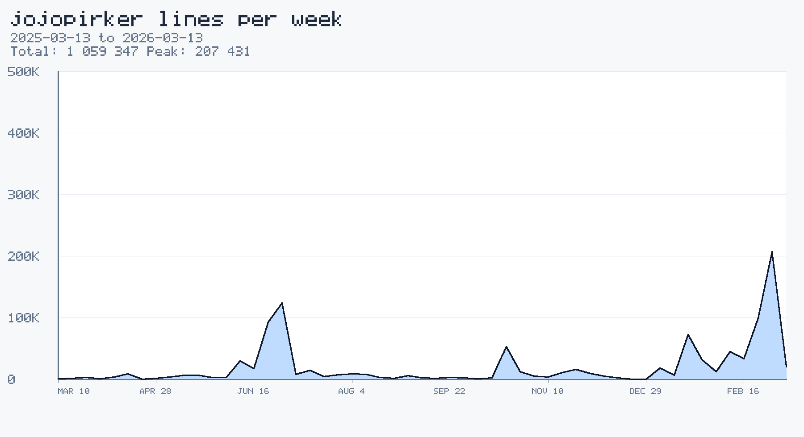
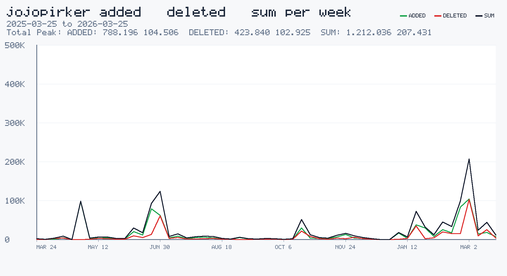

# locmeter

[](https://www.npmjs.com/package/locmeter)

`locmeter` is a dependency-free Node CLI that scans your locally cloned GitHub contribution repos, aggregates added and deleted lines by day, week, or month, and renders a PNG chart.

Repository: `jojopirker/locmeter`

```bash
npx locmeter
```





## Requirements

- Node.js 18+
- `gh` CLI authenticated
- network access for `gh api`
- local clones of the repos you want included
- `git`

## Usage

```bash
locmeter
```

Or without installing globally:

```bash
npx locmeter
```

## Install

```bash
npm install -g locmeter
```

Common options:

- default bucket: `week`
- default mode: `sum`
- default `--to`: today
- default `--from`: one year before `--to`
- default author identity: auto-detected from your current `gh` login
- default repo root: current directory, then common roots like `~/Developer`, `~/Code`, `~/Projects`
- default search depth: `3`
- `--from YYYY-MM-DD`
- `--to YYYY-MM-DD`
- `--days N`
- `--bucket day|week|month`
- `--mode sum|added|deleted|added/deleted|added/deleted/sum`
- `--root /path/to/repos`
- `--search-depth N`
- `--author-email you@example.com`
- `--author-name yourname`
- `--output chart.png`
- `--json-output data.json`

Modes:

- `sum`
- `added`
- `deleted`
- `added/deleted`
- `added/deleted/sum`

Example:

```bash
locmeter \
  --root ~/Developer \
  --bucket week \
  --mode added/deleted/sum \
  --output examples/jojo-weekly-added-deleted-sum.png \
  --json-output examples/jojo-weekly-added-deleted-sum.json
```

The CLI prints the generated PNG path and JSON path on success.

## Notes

- `locmeter` is intended for global CLI usage.
- JSON output includes separate `added`, `deleted`, and `sum` series.
